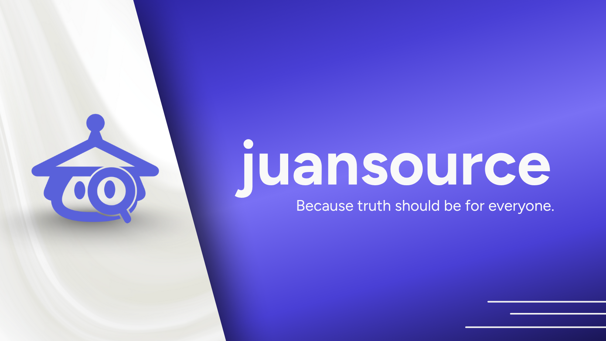

juansource (short for Juan’s Source of Truth) is a fact-checking web application designed to help Filipinos identify misinformation and fake news online. Built by students under the name Team AltTab, the project aims to make truth accessible to every Juan — simple, fast, and grounded in verified sources. 
> *In a sea of misinformation, juansource stands as a small voice that answers with truth.*

This project uses **FastAPI** for the backend and **React (Vite + TailwindCSS)** for the frontend.  
It integrates **LangChain**, **Google Generative AI**, and **Tavily Search API** for real-time fact-checking.

---

# Docker Setup (Frontend + Backend + PostgreSQL/pgvector)

1. Create or update `backend/.env` with your API keys.

```
GOOGLE_API_KEY=your_google_api_key_here
TAVILY_API_KEY=your_tavily_api_key_here
GEMINI_MODEL=gemini-2.5-flash
TURNSTILE_SECRET_KEY=your_turnstile_secret_key_here
ANON_COOKIE_SECRET=your_random_cookie_signing_secret
```

For frontend Turnstile widget, also set this environment variable before building frontend:

```
VITE_TURNSTILE_SITE_KEY=your_turnstile_site_key_here
```

2. Start all services (local/dev).

```
docker compose up --build
```

3. Open the apps (local/dev).

- Frontend: http://localhost:5173
- Backend: http://localhost:8001/docs
- PostgreSQL: localhost:5432

4. Stop all services.

```
docker compose down
```

## Production Docker Profile

Use the production compose file to run the production-ready stack with an edge Nginx container.

1. Build frontend assets locally or in CI (not on the server).

```
cd frontend
npm ci
npm run build
```

2. Build and publish the runtime-only frontend image.

```
docker build -f frontend/Dockerfile.prod -t juansource-frontend:prod frontend
```

3. Start production services on the server.

```
docker compose -f docker-compose.prod.yml up -d
```

If your server should pull a registry image, set JUANSOURCE_FRONTEND_IMAGE before running compose.

```
export JUANSOURCE_FRONTEND_IMAGE=ghcr.io/your-org/juansource-frontend:prod
docker compose -f docker-compose.prod.yml up -d
```

4. Open production endpoints.

- Frontend (Nginx): http://localhost:3000
- Backend (FastAPI): http://localhost:8001/docs

5. Stop production services.

```
docker compose -f docker-compose.prod.yml down
```

### Semantic Cache (Gemini endpoint)

The `/fact-check` endpoint now uses PostgreSQL + pgvector semantic caching.

- Top-1 vector match is checked before running full search + LLM.
- Cache match rule uses minimum similarity threshold.
- Cache rows expire using TTL.
- `/fact-check-ollama` remains uncached by default.

Environment variables (configured in `docker-compose.yml`):

- `SEMANTIC_CACHE_ENABLED` (default `true`)
- `SEMANTIC_CACHE_MIN_SIMILARITY` (default `0.87`)
- `SEMANTIC_CACHE_TTL_SECONDS` (default `86400`)
- `SEMANTIC_CACHE_EMBEDDING_MODEL` (default `models/text-embedding-004`)

### Trusted Source Allowlist

Search is restricted to these sources:

- verafiles.org/articles
- gmanetwork.com/news
- news.abs-cbn.com
- newsinfo.inquirer.net
- philstar.com/headlines
- philstar.com/nation
- bworldonline.com

### Prompt Guard And Human Verification

- Anonymous users are identified with a signed HTTP-only cookie issued by backend.
- Prompt usage is limited to 3 requests per day per anonymous cookie ID.
- Daily reset follows Asia/Manila midnight.
- Cloudflare Turnstile verification is required before each prompt is processed.

---
# 📋 Features
- 💬 Fact-Checking Chatbot Interface — Conversational verification of claims and headlines.
- 🔍 Real-Time Data Retrieval — Integrates Tavily Search for fresh, source-backed results.
- 🧩 AI-Powered Reasoning — Uses Gemini 2.5 Flash (via LangChain) for classification and explanation.
- 🌐 Accessible Frontend — Built with React + Tailwind for clean, fast, and responsive use.
- 🛠️ Lightweight Backend — FastAPI handles API requests and RAG pipeline efficiently.

---

## 🖥️ Backend Setup

### 
1️⃣ Navigate to the backend folder
```
cd backend
```
2️⃣ Create a virtual environment
```
python -m venv venv
```
3️⃣ Activate the virtual environment
```
.\venv\Scripts\Activate.ps1
```
4️⃣ Install dependencies
```
pip install fastapi uvicorn python-dotenv
pip install langchain langchain-google-genai langchain-community
pip install tavily-python
```
5️⃣ Create a .env file inside the backend folder
```
Create a new file named .env and add your credentials

GOOGLE_API_KEY=your_google_api_key_here
TAVILY_API_KEY=your_tavily_api_key_here
```
6️⃣ Run the backend server
```
uvicorn app.main:app --reload --port 8000
```
Your backend will now run on: http://127.0.0.1:8000

## 💡 Frontend Setup 

###
1️⃣ Create the frontend project
```
npm create vite@latest frontend -- --template react
```
2️⃣ Go to the frontend folder
```
cd frontend
```
3️⃣ Install dependencies
```
npm install
```
4️⃣ Install TailwindCSS
```
npm install -D tailwindcss postcss autoprefixer
npx tailwindcss init -p
```
5️⃣ Run the frontend
```
npm run dev
```
Your frontend will now be live on: http://localhost:5173

---

# 🚀 How It Works
1️⃣ User enters a claim or headline (e.g., “Apples are orange.”)

2️⃣ juansource fetches relevant snippets from Tavily Search.

3️⃣ The system analyzes the context using Gemini 2.5 Flash and LangChain.

4️⃣ Returns a classification (True / False / Uncertain) with reasoning and citations.

---

# 💜 Our Vision

To make truth accessible, inclusive, and transparent for every Filipino.
In the future, juansource aims to:

- Support Filipino and regional languages
- Monitor and combat misinformation trends in real-time
- Partner with media and educational institutions to promote digital literacy

---

### 💻 Team AltTab
*Built by students, for every Juan.* 💜 

- [@paulo10011](https://github.com/paulo10011) 
- [@CreampuffWasEatenBySora](https://github.com/CreampuffWasEatenBySora) 
- [@Neil-023](https://github.com/Neil-023)   
- [@A-tio](https://github.com/A-tio) 
- [@alhtb](https://github.com/alhtb) 
  


